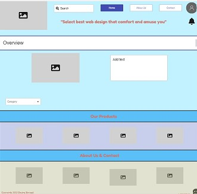
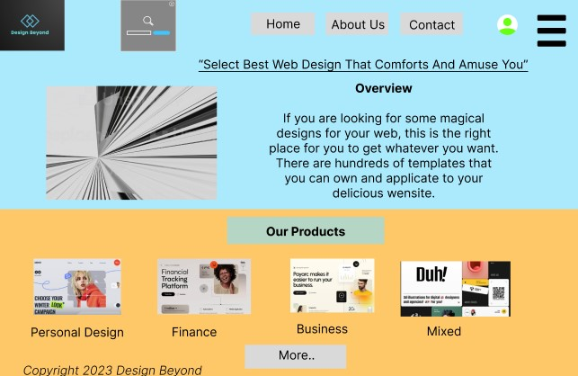
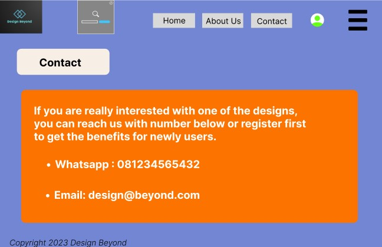

# Boy Oloan Design for UI/UX

> This is mandatory assignment for this week. All contents can be found on the links below.

## Link related to assignment

- For [Miro](https://miro.com/welcomeonboard/R05lUE1td1lYZFk5V29uM2U0Q3NUYUhNZGRKam5WMTVDUXpOWE5sdWtxZkJpejZ1bm1OZUdKSXlqN0hMZEtJdXwzNDU4NzY0NTQ0MTU0MTg2NjM2fDI=?share_link_id=893159727344)

- For [Figma](https://www.figma.com/file/0X51YeWC2NtpSIw9DmBws5/Website-Design?node-id=0%3A1&t=NlfVC3aPLbz6QOZX-1)

## Screenshots

- Wireframe

- Mockup & Prototyping

### Picks of Colorhunt

- 86E5FF
- FEC868
- B5D5C5
- B7B78A

### Inspirations of Websites

- [Stord](https://www.stord.com/)
- [KD Capital](https://kdcap.com/)
